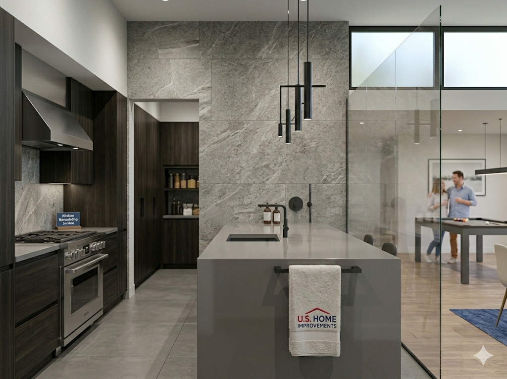
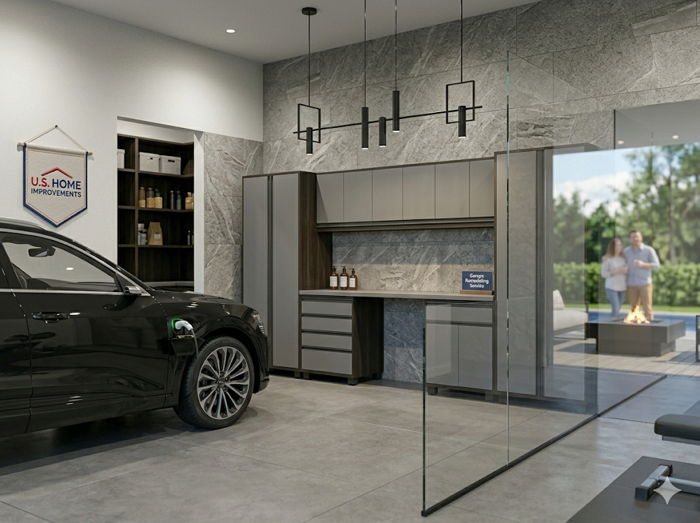

<html lang="en">
<head>
    <meta charset="UTF-8">
    <meta name="viewport" content="width=device-width, initial-scale=1.0">
    <title>U.S. HOME IMPROVEMENT | National Authorized Network</title>
    
    <link href="https://fonts.googleapis.com/css2?family=Plus+Jakarta+Sans:wght@400;700;800&display=swap" rel="stylesheet">
    
    

    
</head>
<body>

    <nav class="bg-white border-b px-6 py-4 flex justify-between items-center sticky top-0 z-[1000]">
        

            
            

                U.S. Home Improvement
                
● California Licensed #786-092

            

        

        
National Headquarters

    </nav>

    <header class="hero-gradient py-12 px-6 text-center text-white">
        <h1 class="text-3xl font-black uppercase italic tracking-tighter mb-2">Qualified Upgrade Matrix</h1>
        
Official Contractor Hub • Nationwide 2026

    </header>

    <main class="max-w-md mx-auto px-4 -mt-8 mb-20 relative z-10">
        

            <form id="qualifyForm">
                

                    <label class="text-[10px] font-black text-slate-400 uppercase block mb-3">01. Selection</label>
                    
What kind of home improvements are you looking for?

                    <select id="mainService" class="input-pro mb-4" onchange="updateSub()" required>
                        <option value="Roofing">Roofing Solutions</option>
                        <option value="Solar">Solar Panels</option>
                        <option value="Windows">Windows Replacement</option>
                        <option value="Doors">Entry Doors</option>
                        <option value="Garage">Garage System</option>
                        <option value="Deck">Custom Decking</option>
                        <option value="Kitchen">Kitchen Remodel</option>
                        <option value="Bathroom">Bathroom Remodel</option>
                        <option value="Siding">Exterior Siding</option>
                    </select>
                    <select id="isOwner" class="input-pro mb-4" required>
                        <option value="">Are you the home owner?</option>
                        <option value="Yes">Yes, I am the owner</option>
                        <option value="No">No, I am a tenant</option>
                    </select>
                    <button type="button" onclick="goStep('step2')" class="btn-action">Next Step</button>
                

                

                    <label class="text-[10px] font-black text-slate-400 uppercase block mb-3">02. Qualification Matrix</label>
                    

                    <select id="creditScore" class="input-pro mb-4" required>
                        <option value="">Estimated Credit Score?</option>
                        <option value="Excellent">720+ (Excellent)</option>
                        <option value="Good">660-719 (Good)</option>
                        <option value="Fair">600-659 (Fair)</option>
                        <option value="Needs Work">Below 600</option>
                    </select>
                    <button type="button" onclick="goStep('step3')" class="btn-action">Authorize Appointment</button>
                

                

                    <label class="text-[10px] font-black text-slate-400 uppercase block mb-3">03. Verification</label>
                    <input type="text" id="custAddress" placeholder="Street Address" class="input-pro mb-3" required>
                    

                        <input type="text" id="custZip" placeholder="Zip" class="input-pro mb-3" required>
                        <input type="text" id="custName" placeholder="Full Name" class="input-pro mb-3" required>
                    

                    <input type="email" id="custEmail" placeholder="Email Address" class="input-pro mb-3" required>
                    <input type="tel" id="custPhone" placeholder="Phone Number" class="input-pro mb-3" required>
                    

                        <input type="date" id="appDate" class="input-pro" required>
                        <select id="appTime" class="input-pro" required>
                            <option value="Morning">Morning</option>
                            <option value="Afternoon">Afternoon</option>
                        </select>
                    

                    <button type="submit" class="btn-action">Confirm & Submit</button>
                

            </form>
        

    </main>

    <section class="max-w-4xl mx-auto px-6 mb-20 text-center">
        <h2 class="font-black uppercase text-[10px] tracking-widest text-slate-400 mb-10 italic">Premium Portfolio</h2>
        

            
<h4>Roofing</h4>

            
<h4>Solar Panels</h4>

            
<h4>Windows</h4>

            
<h4>Doors</h4>

            
<h4>Kitchen</h4>

            
<h4>Bathroom</h4>

            
<h4>Garage</h4>

            
<h4>Deck</h4>

        

    </section>

    <footer class="bg-slate-900 py-16 px-8 text-white">
        

            

                <h4 class="text-blue-400 mb-4">Headquarters</h4>
                

                    702 Main Street 
                    Woodland, California 95695 
                    United States
                

            

            

                <h4 class="text-blue-400 mb-4">Authorized Support</h4>
                
ushomeimprovement07@gmail.com

                
National Service Network

            

            

                <h4 class="text-blue-400 mb-4">Policy Hub</h4>
                

                    Privacy Policy
                    Terms of Service
                    © 2026 MATRIX HUB
                

            

        

    </footer>

    

        
<h3 class="font-black uppercase">Leads HQ</h3><button onclick="toggleAdmin()" class="text-red-500 font-bold">EXIT</button>

        

            <input type="password" id="pin" class="input-pro max-w-[200px] text-center mb-4" placeholder="PIN">
            <button onclick="unlock()" class="btn-action max-w-[200px]">Unlock</button>
        

        

    

    
</body>
</html>
