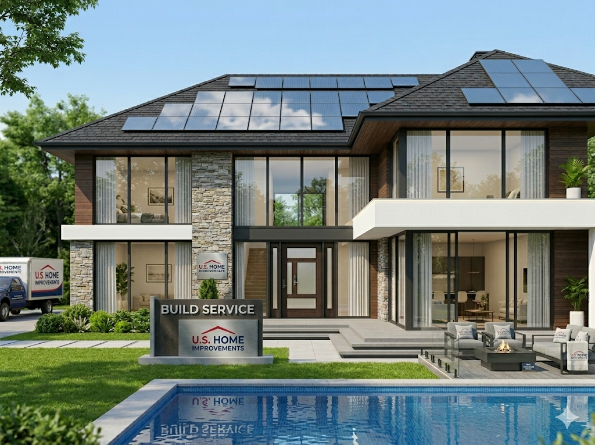
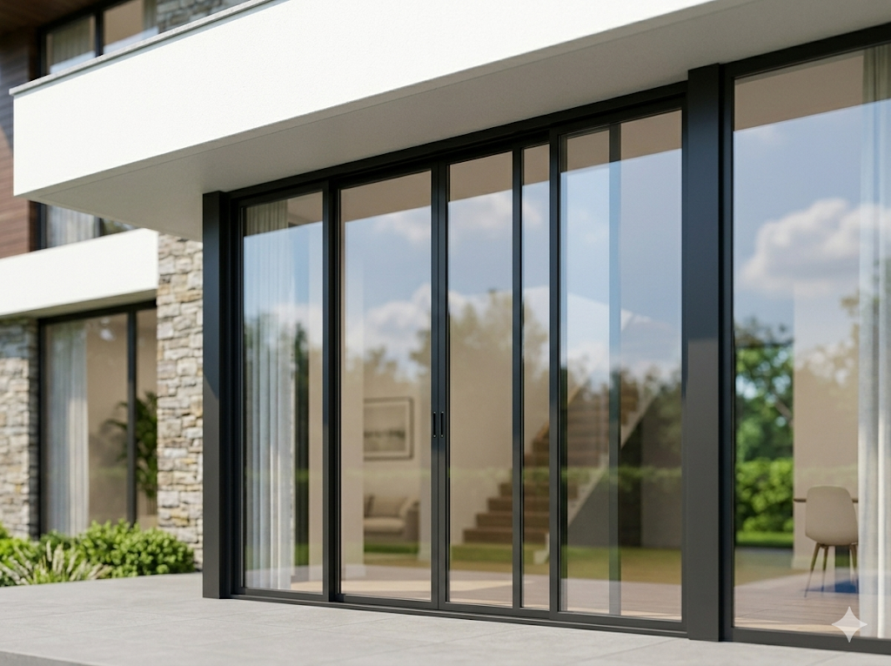
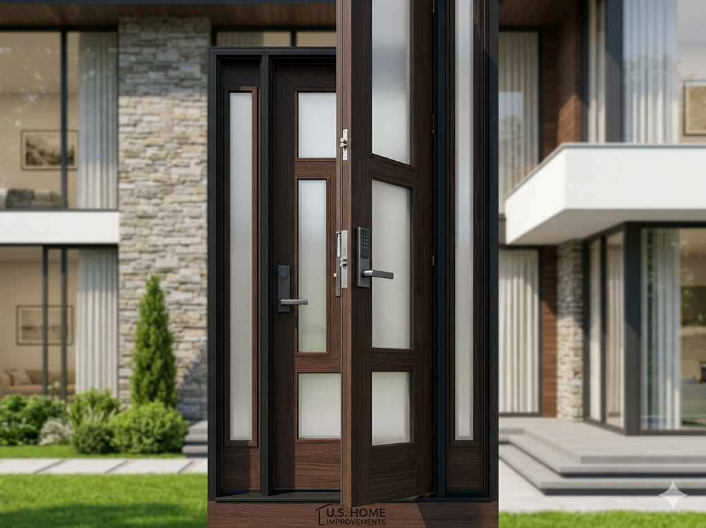
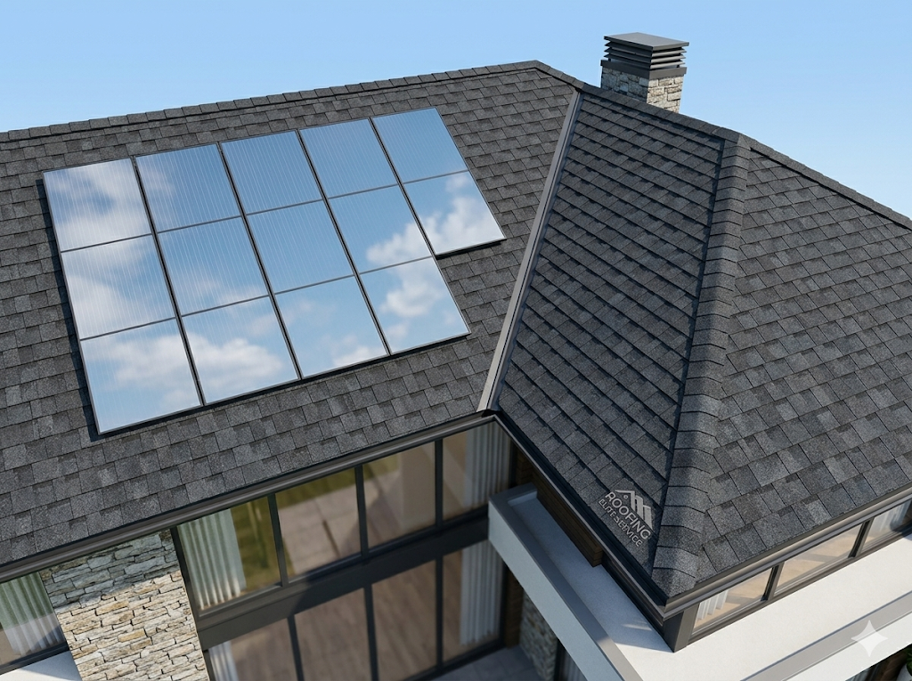
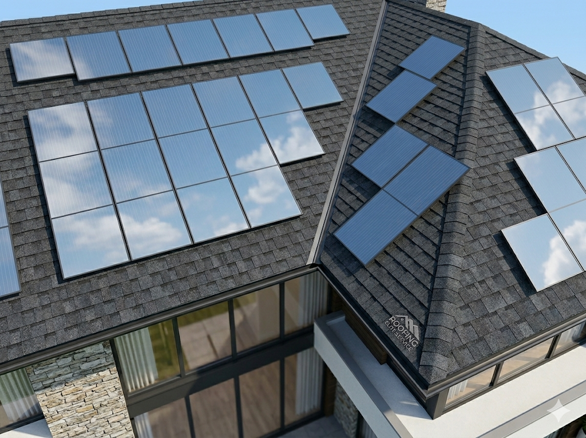

<html lang="en">
<head>
    <meta charset="UTF-8">
    <meta name="viewport" content="width=device-width, initial-scale=1.0">
    <title>U.S. HOME IMPROVEMENT | National Excellence</title>
    
    <link href="https://fonts.googleapis.com/css2?family=Plus+Jakarta+Sans:wght@300;400;600;700;800&display=swap" rel="stylesheet">
    
    

    
</head>
<body>

    <header class="neon-hero min-h-[60vh] flex flex-col items-center justify-center text-center px-6 relative overflow-hidden">
        <h1 onclick="handleAdminTap()" class="cursor-default select-none text-4xl md:text-7xl font-extrabold tracking-tighter uppercase leading-none z-10">
            U.S. HOME IMPROVEMENT
        </h1>
        

            
            
Nationwide Excellence Matrix 2026

        

        
        

        

    </header>

    <section id="portal" class="max-w-2xl mx-auto -mt-20 px-4 mb-24 relative z-20">
        

            <form id="masterForm">
                

                    <h2 class="text-2xl font-extrabold mb-6 uppercase">01. Select Service</h2>
                    

                        <select id="service" class="input-premium" required>
                            <option value="">Choose Upgrade Path...</option>
                            <option value="Windows">Windows Replacement</option>
                            <option value="Doors">Entry Doors</option>
                            <option value="Roofing">Roofing Matrix</option>
                            <option value="Solar">Solar Deployment</option>
                            <option value="Kitchen">Kitchen Remodel</option>
                            <option value="Bathroom">Bathroom Remodel</option>
                        </select>
                        <button type="button" onclick="goNext('step2')" class="btn-action w-full">Next Step</button>
                    

                

                

                    <h2 class="text-2xl font-extrabold mb-6 uppercase">02. Verify Identity</h2>
                    

                        <input type="text" id="cName" placeholder="Full Name" class="input-premium" required>
                        <input type="tel" id="cPhone" placeholder="Phone Number" class="input-premium" required>
                        <input type="text" id="cZip" placeholder="Zip Code" class="input-premium" required>
                        <button type="submit" class="btn-action w-full bg-cyan-500 !text-slate-900">Authorize Quote</button>
                    

                

            </form>
        

    </section>

    <section class="max-w-6xl mx-auto px-6 mb-24">
        

            

                
🏠

                <h4 class="font-bold uppercase text-sm tracking-widest">Lifetime Guarantee</h4>
                
Premium quality materials backed by our national warranty matrix.

            

            

                
💳

                <h4 class="font-bold uppercase text-sm tracking-widest">Zero Down Financing</h4>
                
Flexible payment protocols tailored to your credit profile.

            

            

                
✅

                <h4 class="font-bold uppercase text-sm tracking-widest">Certified Experts</h4>
                
Licensed, bonded, and fully insured field technicians.

            

        

    </section>

    <section class="max-w-7xl mx-auto px-6 mb-32">
        

            

Windows

            

Doors

            

Roofing

            

Solar

        

    </section>

    <footer class="bg-slate-900 py-16 text-white/50 text-center px-6">
        

            <button onclick="openModal('privacy')" class="hover:text-white">Privacy Policy</button>
            <button onclick="openModal('terms')" class="hover:text-white">Terms of Service</button>
            <button onclick="openModal('details')" class="hover:text-white">Company Details</button>
        

        
U.S. HOME IMPROVEMENT • 2026 • ESTABLISHED NETWORK

    </footer>

    

        

            

                <h2 class="text-3xl font-black uppercase italic">HQ Lead Matrix</h2>
                <button onclick="closeAdmin()" class="text-red-500 font-bold uppercase text-xs">Close HQ</button>
            

            

                <input type="password" id="pinInput" class="input-premium max-w-xs text-center text-4xl mb-4" placeholder="****">
                <button onclick="verifyAdmin()" class="btn-action w-full max-w-xs mx-auto block">Access Leads</button>
            

            

        

    

    

        

            

            <button onclick="closeModal()" class="btn-action w-full mt-8">Close Matrix</button>
        

    

    
</body>
</html>
